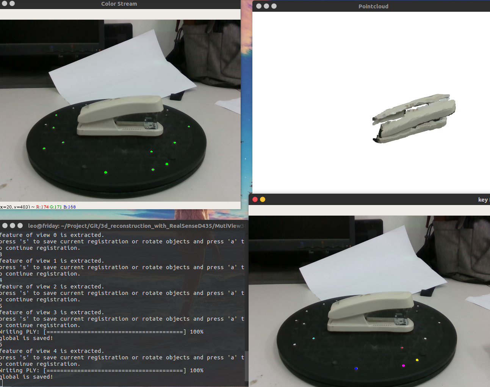
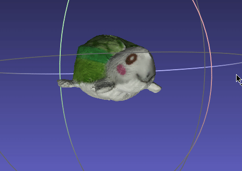
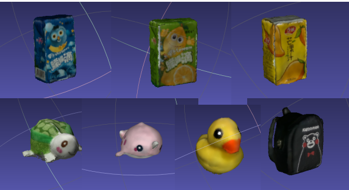

# 3D Object Reconstruction Based on Muti-view RGBD Images Using Turntable

## Requirements
* [NumPy](https://pypi.org/project/numpy/)
* [OpenCV](https://pypi.org/project/opencv-python/)
* [PyRealsense2](https://pypi.org/project/pyrealsense2/)
* [Open3D](https://github.com/IntelVCL/Open3D)


## Usage:
The script is modified from MutiView3DReconstruction,you can decide whether to registrate or discard current view's point cloud.
```
python interfaceVersion.py
```
First you to press 'a' three times,to calculate table plane,and add the first view of pointcloud.
Next,press 's' to save current registration 'global.ply'.

Then rotate object,and press 'a' to preview next registration,if you are satisfied with the results,press 's' again to save 'global.ply'.if not ,press 'a' again.

You may change camera position to get a better view,press 'p' to recalculate the table plane coefficient.

All the KeyCallback function is effective in opencv windows,I will make it effective in both opencv and open3d window later.


After you got two parts of an object,you can use 'manual_registration.py' to registration them manually(press 'Shift' and rghit click to select corresponding point pairs).
```
python manual_registration.py
```
later you can use meshlab for a post-processing.

## Reconstructed Objects
turtle


other objects



