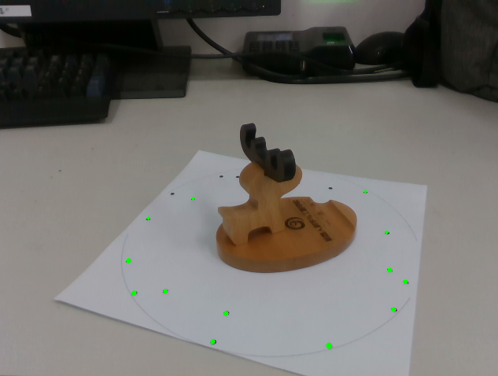
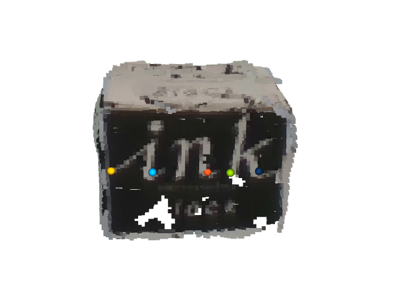
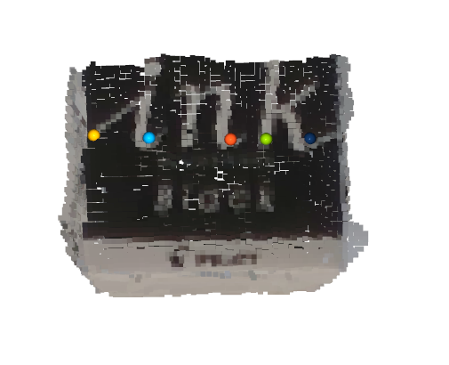

# 3D Object Reconstruction Based on Muti-view RGBD Images Using an A4 Paper

## Requirements
(tested on my ubuntu 16.04)
* [NumPy ](https://pypi.org/project/numpy/) == 1.16.4 
* [OpenCV](https://pypi.org/project/opencv-python/) == 4.1.0.25  
* [PyRealsense2](https://pypi.org/project/pyrealsense2/) == 2.17.1.457  
* [Open3D ](https://github.com/IntelVCL/Open3D) == 0.8.0

## Usage:
1. print 'template.pdf' at real size first.

2. pace it on the table like this.

3. `python interfaceVersion.py` 
it will look like this,

4. press =='a'==  **three times** (on the cv2 window) to calculate the plane coefficient and registrate current view pointcloud to global coordinate system.

for top two picture,the same color means the same point.

5. press 's' (on the cv2 window) to save current pointcloud showed in o3d visualizer,you will see 'global.pcd' and 'global.ply' in the source folder.
or adjust the paper(and object ) , press 'a' to see the new registration result. 

6. keep press 's' or 'a' (on the cv2 window),to get a closed loop,and press 'q' (on the cv2 window) to quit.
you will get following result.

7. when you get two parts pointcloud of an object,change 'manual_registration.py' line 56,and line 58, and `python manual_registration.py' ,press 'q' (on the o3d window),then shift + left click to pick corresponding points(at least 3 pairs) in two part pointclouds of an object.you will get 

8. you get a complete point cloud of an object,like this

9. you can use meshlab to modify it,and get the final model.
