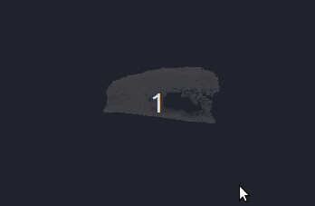

# 3D Object Reconstruction Based on Muti-view RGBD Images Using Turntable

## Requirements
* [NumPy](https://pypi.org/project/numpy/)
* [OpenCV](https://pypi.org/project/opencv-python/)
* [PyRealsense2](https://pypi.org/project/pyrealsense2/)
* [Open3D](https://github.com/IntelVCL/Open3D)


## Usage:
To reproduce the Polarbear Pointcloud.
```
python MutiViewReconstruction.py
```
After a few seconds,it will generate a 'global.pcd' file.

## Other Reconstructed Objects
Peach(textureless)

Stapler

