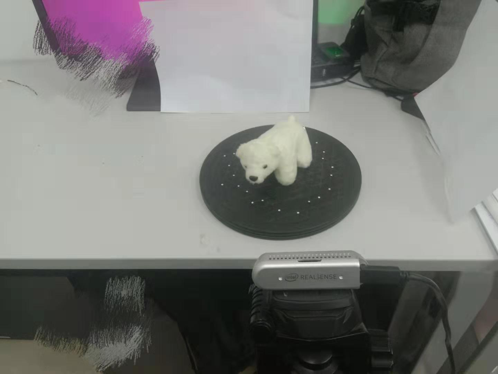

# 3D Reconstruction with RealSenseD435
Some personal implementation of 3d reconstruction with Realsense D435.

## Contents
* **Basic**
> 1.capture RGBD pointcloud and save RGBD images

> 2.Record RGBD stream as '.bag' file

> 3.Read RGBD '.bag' file
* **3D Object Reconstruction Based on Muti-view RGBD Images Using A Turntable**
> 1.Using a turntable to reconstruct an object's 3d pointcloud.

* **Realtime 3D Reconstruction Using Double Opposing RealSenses**
> coming soon
* **Stereo Vision Using Double RealSense RGB cameras**
> coming soon

## Screenshots
reconstruction of a Polar bear

realtime registration of pointclouds from two cams.

## Platform
Ubuntu 16.04

