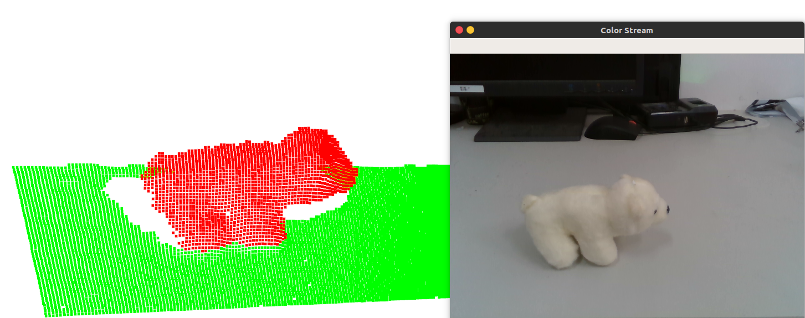

# 3D Reconstruction with RealSenseD435
Some personal implementation of 3d reconstruction with Realsense D435.

## Contents
* **Basic**
> 1.capture RGBD pointcloud and save RGBD images

> 2.Record RGBD stream as '.bag' file

> 3.Read RGBD '.bag' file
* **3D Object Reconstruction Based on Muti-view RGBD Images Using A Turntable**
> Using a turntable to reconstruct an object's 3d pointcloud.

* **Realtime 3D Reconstruction Using Double Opposing RealSenses**
> Using a double side chessBoard.

* **Object Recognition Using PointNet**

 
* **Stereo Vision Using Double RealSense RGB cameras**
> to be done

## Screenshots
reconstruction of a Polar bear
<!--  -->

realtime registration of pointclouds from two cams.

<!--  -->

## Platform
Ubuntu 16.04
