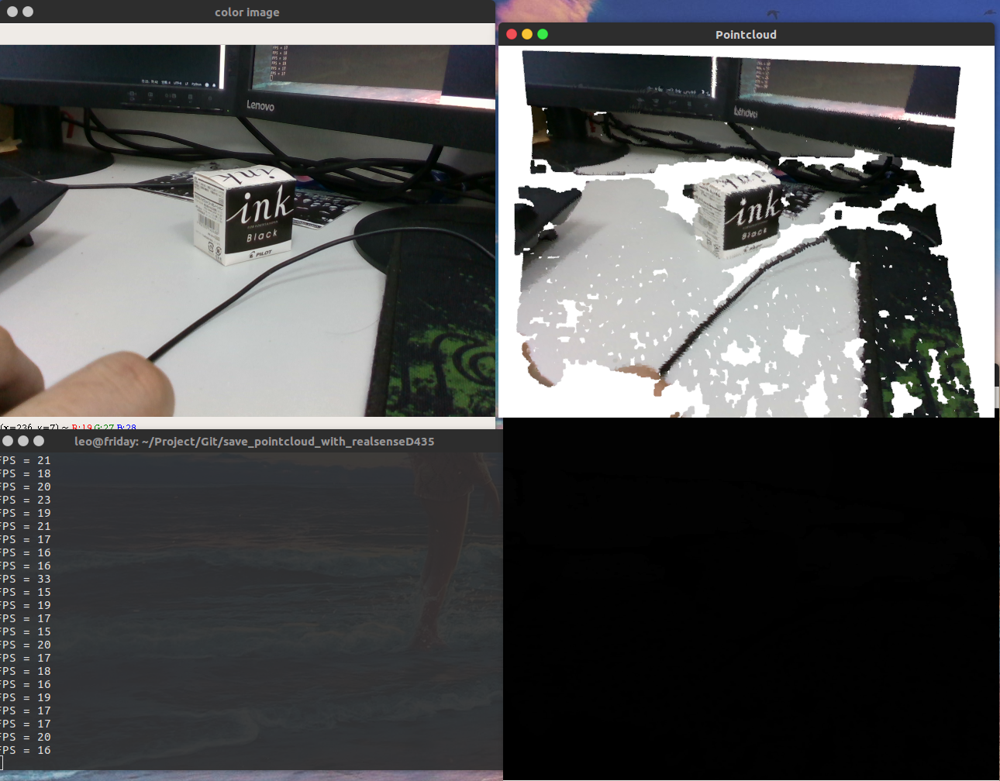
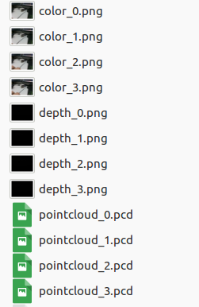

# Save_pointcloud_with_realsenseD435
This script is written accoding to the code mentioned in the issue [Convert Realsense poincloud in Open3D pointcloud](https://github.com/IntelVCL/Open3D/issues/473)

## Requirements
* numpy
* [opencv](https://pypi.org/project/opencv-python/)
* [Install the latest Intel® RealSense™ SDK 2.0](https://github.com/IntelRealSense/librealsense/blob/master/doc/distribution_linux.md)
* [pyrealsense2](https://pypi.org/project/pyrealsense2/)
* [Open3D](https://github.com/IntelVCL/Open3D)


## Usage:
```python
python capt_pt.py
```

Press ‘s’ on the image(depth or color) window，the current rgb-d images and pointcloud will be saved.

Press 'q' ,the pipeline will be stopped.




 
