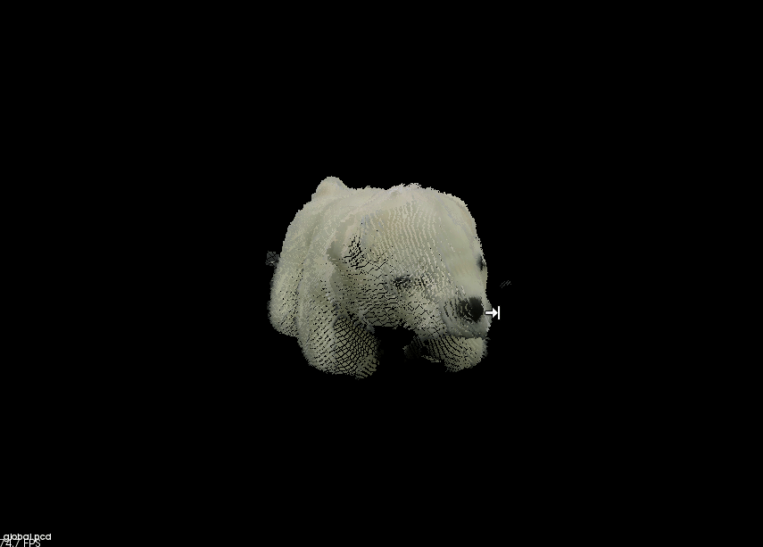
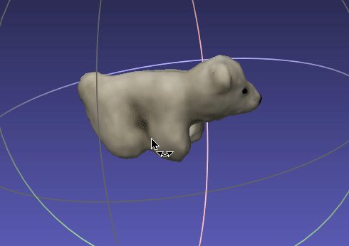
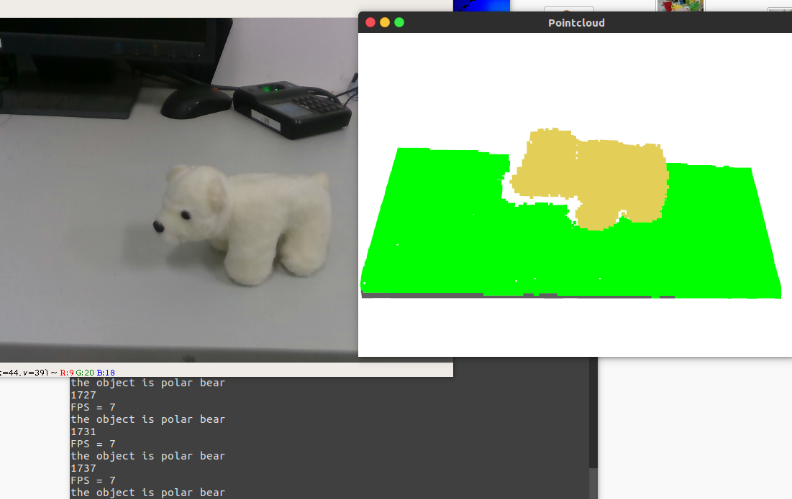

# 3D Reconstruction with RealSenseD435
Some personal implementation of 3d reconstruction with Realsense D435.

## Contents
* **Basic**
> 1.capture RGBD pointcloud and save RGBD images

> 2.Record RGBD stream as '.bag' file

> 3.Read RGBD '.bag' file
* **3D Object Reconstruction Based on Muti-view RGBD Images Using An A4 paper**
> Using an A4 paper to reconstruct an object's 3d pointcloud.

* **Realtime 3D Reconstruction Using Double Opposing RealSenses**
> Using a double side chessBoard to realtime registrating pointclouds from two opposite rgbd camera.

* **Object Recognition Using PointNet**
> Realtime 3d object partial pointcloud recognition based on PointNet.
 

## Screenshots
reconstruction of a Polar bear

modified by meshlab

realtime registration of pointclouds from two cams.

Realtime object recognition using PointNet.

