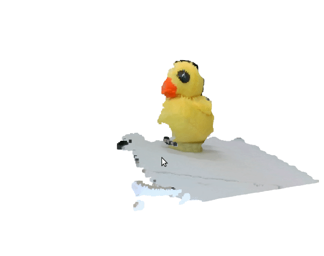
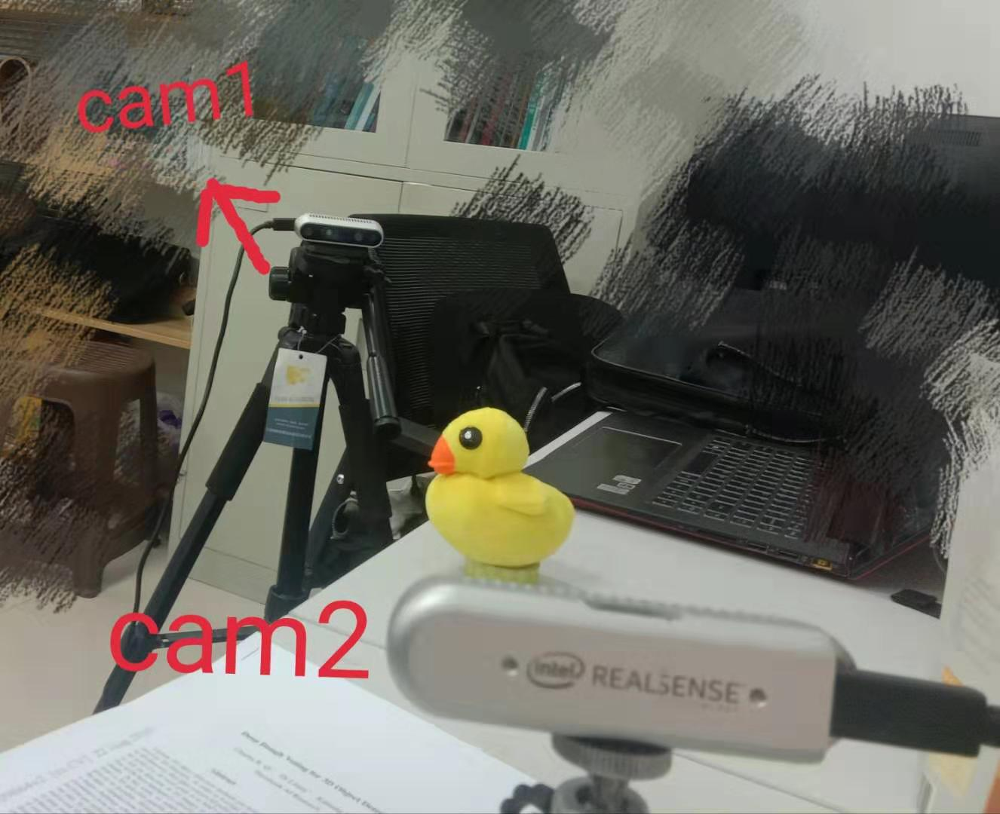

# Realtime 3D Reconstruction Using Double Opposing RealSenses

## Requirements
* [NumPy](https://pypi.org/project/numpy/)
* [OpenCV](https://pypi.org/project/opencv-python/)
* [PyRealsense2](https://pypi.org/project/pyrealsense2/)
* [Open3D](https://github.com/IntelVCL/Open3D)


## Usage:
You need calibrate two camera first with a doubleside chessboard.
```
python Calibration.py
```


press 's' to save several pictures that ChessBoard appears in both cameras's view. the picture will be saved in the 'output/' directory.

then change line 15 `chessBoard_num = your picture num` in the 'Realtime.py'file.

later 
```
python Realtime.py
```
you will see the registration result.




